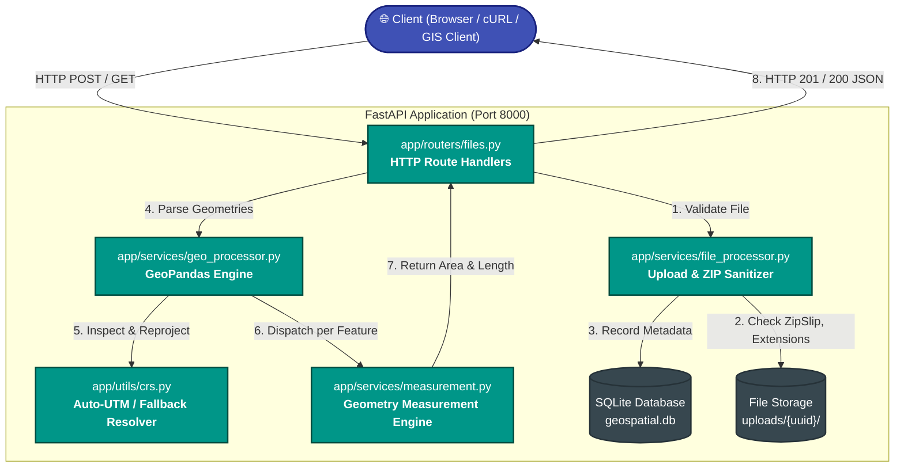
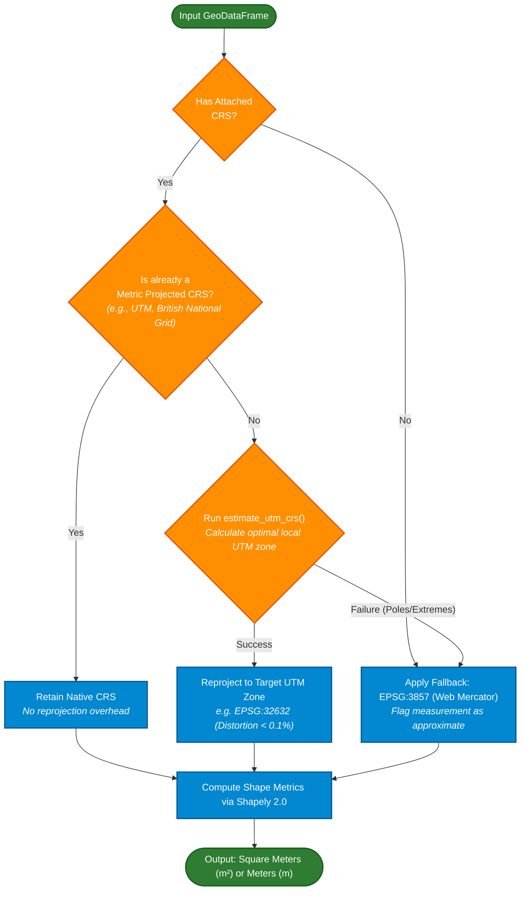

<div align="center">

# 🌍 GeoMeasure API
### *High-Precision, CRS-Aware Geospatial Feature Measurement Microservice*

[](https://www.python.org/)
[](https://fastapi.tiangolo.com/)
[](https://geopandas.org/)
[](https://docs.pytest.org/)
[](https://www.sqlite.org/)
[](LICENSE)

<p align="center">
  <b>Extract polygons, lines, and geometries from KML and Shapefiles — reproject automatically into optimal local UTM zones — and calculate true physical area ($m^2$) and distance ($m$) with millimeter-grade metric accuracy.</b>
</p>

[🚀 Quickstart](#-quickstart-in-60-seconds) •
[🧠 The Coordinate Paradox](#-the-core-problem-the-wgs-84-paradox) •
[⚙️ Architecture & Pipeline](#-system-architecture--processing-pipeline) •
[📡 API Reference](#-api-reference--playground) •
[📐 CRS Decision Engine](#-crs-resolution-decision-engine) •
[🧪 Test Suite](#-automated-testing-suite) •
[🗺️ Roadmap](#-roadmap--future-scope)

---

</div>

## 📌 Executive Summary

Processing raw geospatial files (`.kml`, Shapefile `.zip`) often presents a deceptive trap: geometry engines default to calculating distances and surface areas directly on angular degrees (EPSG:4326 / WGS 84).

**GeoMeasure API** eliminates this problem by providing a production-grade REST microservice that:
1. **Ingests & Validates:** Accepts `.kml` and zipped ESRI Shapefiles (`.shp`, `.dbf`, `.shx`) up to 100 MB.
2. **Intelligently Reprojects:** Autonomously determines the optimal metric projected CRS (such as local Universal Transverse Mercator / UTM zones) based on geographic extent using Fiona & PyProj.
3. **Calculates Physical Measurements:** Derives true ground area in **square meters ($m^2$)** for Polygons and linear distance in **meters ($m$)** for LineStrings.
4. **Isolates Errors:** Gracefully handles non-measurable features (Points, MultiPoints, empty or corrupted rings) without failing the batch upload.
5. **Persists Traceability:** Records upload metadata in an internal SQLite database for queryable lifecycle tracking.

---

## 💥 The Core Problem: The WGS 84 Paradox

Most GIS and GPS files export coordinates in **EPSG:4326 (WGS 84)** — spherical angles of latitude and longitude.

```
❌ NAIVE CALCULATION (In WGS 84 Degrees):
┌────────────────────────────────────────────────────────────────────────┐
│ Polygon Area  : 0.00004523  square degrees  (Physically meaningless!)  │
│ Line Length   : 0.01524100  degrees         (Varies by latitude!)      │
└────────────────────────────────────────────────────────────────────────┘

✅ GEOMEASURE RESOLUTION (Reprojected to UTM Zone 32N - EPSG:32632):
┌────────────────────────────────────────────────────────────────────────┐
│ Polygon Area  : 548,291.45  m²              (Accurate ground area)     │
│ Line Length   : 1,692.30    m               (Accurate ground distance) │
└────────────────────────────────────────────────────────────────────────┘
```

> [!CAUTION]
> **Why degrees cannot represent distance or area:**
> At the Equator ($0^\circ$), $1^\circ$ of longitude spans $\approx 111.32\text{ km}$. At $60^\circ\text{ N}$ (Oslo / Anchorage), $1^\circ$ of longitude contracts to only $\approx 55.80\text{ km}$. Calculating raw Euclidean distance across degree coordinates distorts measurements by up to **$50\text{--}99\%$**!

GeoMeasure inspects every incoming feature batch and transforms coordinates into an area-preserving, metric-projected coordinate space prior to measurement dispatch.

---

## ⚡ Quickstart in 60 Seconds

### Prerequisites
- **Python 3.12+**
- Git & PowerShell (Windows) or Bash (Linux / macOS)

### 1. Clone & Set Up Virtual Environment

```powershell
# Clone the repository
git clone https://github.com/sudharsini-0411/Geospatial_File_Measurement.git
cd Geospatial_File_Measurement

# Create and activate Python virtual environment
python -m venv venv
.\venv\Scripts\Activate.ps1    # On Linux/macOS: source venv/bin/activate

# Install locked dependencies
pip install -r requirements.txt
```

> [!TIP]
> GeoPandas wheels for Windows include pre-compiled GDAL, GEOS, and PROJ binaries. No complex system-level C++ installations are needed!

### 2. Launch Development Server

```powershell
uvicorn app.main:app --reload --host 127.0.0.1 --port 8000
```

The server spins up instantly at `http://127.0.0.1:8000`.

### 3. Interactive Documentation
Explore the generated OpenAPI 3.1 specifications:
- **Swagger UI (Interactive Playground):** [http://127.0.0.1:8000/docs](http://127.0.0.1:8000/docs)
- **ReDoc (Specification Reader):** [http://127.0.0.1:8000/redoc](http://127.0.0.1:8000/redoc)

---

## ⚙️ System Architecture & Processing Pipeline

### Microservice Component Architecture



---

## 📐 CRS Resolution Decision Engine

GeoMeasure follows a mathematically strict fallback hierarchy to ensure every geometry measurement returns physical units:



---

## 🗂️ Geometry Support & Measurement Matrix

| Geometry Type | Computed Dimension | Metric Output Unit | Handling Rationale |
|:---|:---:|:---:|:---|
| **`Polygon`** | **Area** | `square_meters` ($m^2$) | Computes planar enclosed surface area. |
| **`MultiPolygon`** | **Area** | `square_meters` ($m^2$) | Aggregates planar enclosed area of all sub-polygons. |
| **`LineString`** | **Length** | `meters` ($m$) | Cumulative Euclidean distance along ordered vertices. |
| **`MultiLineString`** | **Length** | `meters` ($m$) | Sum of lengths across all constituent line segments. |
| **`Point` / `MultiPoint`** | *None* | `null` | Zero-dimensional feature; returns friendly message. |
| **`GeometryCollection`** | *None* | `null` | Heterogeneous composite geometry; gracefully isolated. |

> [!NOTE]
> **Zero-Crash Fault Isolation:** If an uploaded file contains mixed geometry types or self-intersecting anomalies, individual failing features return a `null` measurement accompanied by an informative message string. **The rest of the batch succeeds without interruption.**

---

## 📡 API Reference & Playground

### Summary of Endpoints

```http
POST   /api/files/                       Upload and measure geospatial file synchronously
GET    /api/files/{file_id}/             Retrieve metadata for an uploaded file
GET    /api/files/{file_id}/measurements/ Retrieve lightweight measurements payload
GET    /                                 Health check and service status
```

---

### 1. Upload & Measure Geospatial File
`POST /api/files/`

Uploads a `.kml` or `.zip` (Shapefile archive), extracts all geometries, performs CRS reprojection, and returns complete feature metadata with measurements.

#### Parameters:
- **`file`** *(form-data, binary)*: Must be `.kml` or `.zip`. Max 100 MB.

#### cURL Request:
```bash
curl -X POST "http://127.0.0.1:8000/api/files/" \
     -H "Accept: application/json" \
     -F "file=@boundaries.kml;type=application/vnd.google-earth.kml+xml"
```

#### Response `201 Created`:
```json
{
  "id": "7b2e9d3e-8c43-4f01-9a4f-56f8f8287d19",
  "filename": "boundaries.kml",
  "status": "completed",
  "feature_count": 2,
  "crs": "EPSG:4326",
  "features": [
    {
      "feature_index": 0,
      "geometry_type": "Polygon",
      "geometry": {
        "type": "Polygon",
        "coordinates": [[[13.3888, 52.5170], [13.3988, 52.5170], [13.3988, 52.5270], [13.3888, 52.5270], [13.3888, 52.5170]]]
      },
      "properties": {
        "name": "District Central Park",
        "category": "Green Zone"
      },
      "area": 743128.45,
      "length": null,
      "unit": "square_meters",
      "message": null,
      "calculation_crs": "EPSG:32633",
      "crs_strategy": "Input CRS 'WGS 84' is not metric projected; reprojected to local UTM (WGS 84 / UTM zone 33N) via estimate_utm_crs()."
    },
    {
      "feature_index": 1,
      "geometry_type": "LineString",
      "geometry": {
        "type": "LineString",
        "coordinates": [[[13.3888, 52.5170], [13.3950, 52.5200], [13.4020, 52.5250]]]
      },
      "properties": {
        "name": "River Promenade"
      },
      "area": null,
      "length": 1420.82,
      "unit": "meters",
      "message": null,
      "calculation_crs": "EPSG:32633",
      "crs_strategy": "Input CRS 'WGS 84' is not metric projected; reprojected to local UTM (WGS 84 / UTM zone 33N) via estimate_utm_crs()."
    }
  ]
}
```

---

### 2. Retrieve File Metadata
`GET /api/files/{file_id}/`

Fetches indexed metadata for any previously processed file by UUID. Ideal for dashboard listings and storage tracking.

#### cURL Request:
```bash
curl -X GET "http://127.0.0.1:8000/api/files/7b2e9d3e-8c43-4f01-9a4f-56f8f8287d19/"
```

#### Response `200 OK`:
```json
{
  "id": "7b2e9d3e-8c43-4f01-9a4f-56f8f8287d19",
  "filename": "boundaries.kml",
  "feature_count": 2,
  "crs": "EPSG:4326",
  "status": "completed",
  "created_at": "2026-10-08T12:00:00Z"
}
```

---

### 3. Retrieve Lightweight Measurements
`GET /api/files/{file_id}/measurements/`

Optimized for analytics or bandwidth-constrained consumers. Delivers computed dimensions without repetitive GeoJSON coordinate strings or attribute dictionaries.

#### cURL Request:
```bash
curl -X GET "http://127.0.0.1:8000/api/files/7b2e9d3e-8c43-4f01-9a4f-56f8f8287d19/measurements/"
```

#### Response `200 OK`:
```json
{
  "file_id": "7b2e9d3e-8c43-4f01-9a4f-56f8f8287d19",
  "measurements": [
    {
      "feature_id": 0,
      "geometry_type": "Polygon",
      "area": 743128.45,
      "length": null,
      "unit": "square_meters",
      "message": null,
      "calculation_crs": "EPSG:32633"
    },
    {
      "feature_id": 1,
      "geometry_type": "LineString",
      "area": null,
      "length": 1420.82,
      "unit": "meters",
      "message": null,
      "calculation_crs": "EPSG:32633"
    }
  ]
}
```

---

## 🛡️ Enterprise-Grade Security & Edge Defense

GeoMeasure implements proactive defensive mechanisms against common file-upload exploits:

```
🛡️ INPUT VALIDATION PIPELINE
├─ [1] Extension Whitelist     ── Reject anything other than .kml and .zip (HTTP 400)
├─ [2] Zero-Byte Guard         ── Block empty files before allocation (HTTP 400)
├─ [3] 100 MB Payload Limit    ── Streaming size-cap protection (HTTP 400)
├─ [4] Zip-Slip Protection     ── Sanitize path traversal "../" in uncompressed archives (HTTP 400)
├─ [5] Shapefile Triad Check   ── Ensure .shp, .dbf, and .shx are co-present (HTTP 400)
└─ [6] PII / Path Obfuscation  ── Host system paths (file_path) are strictly withheld from JSON responses
```

---

## 🏗️ Repository Architecture

```text
geospatial-measurement-api/
├── 📁 app/
│   ├── 📄 main.py               # FastAPI application setup, OpenAPI config & metadata
│   ├── 📄 database.py           # SQLAlchemy SQLite engine & session management
│   ├── 📄 models.py             # FileRecord database entity
│   ├── 📄 schemas.py            # Pydantic v2 validation contracts & response schemas
│   │
│   ├── 📁 routers/
│   │   └── 📄 files.py          # HTTP controllers (POST upload, GET metadata, GET measurements)
│   │
│   ├── 📁 services/
│   │   ├── 📄 file_processor.py # Archive extraction, security filters & disk I/O
│   │   ├── 📄 geo_processor.py  # GeoDataFrame loader, geometry serializer & dispatch
│   │   └── 📄 measurement.py    # Metric area/length calculator with per-feature safety
│   │
│   └── 📁 utils/
│       └── 📄 crs.py            # Coordinate Reference System intelligence & UTM estimation
│
├── 📁 tests/
│   ├── 📄 conftest.py           # Pytest fixtures, mock engines & in-memory test databases
│   ├── 📄 test_api.py           # 14 integration tests for HTTP routes and edge cases
│   ├── 📄 test_measurement.py   # 17 unit tests for geometry accuracy & CRS conversions
│   └── 📁 fixtures/
│       └── 📄 test.kml          # Reference KML polygon test asset
│
├── 📁 uploads/                  # Ephemeral filesystem storage for user files
├── 📄 geospatial.db             # Local SQLite database instance
├── 📄 requirements.txt          # Pinned dependency manifest
└── 📄 README.md                 # Project technical documentation
```

---

## 🧪 Automated Testing Suite

The project includes **31 exhaustive automated tests** covering both API integration contracts and mathematical geometry operations:

```powershell
# Run the complete test suite
pytest tests/ -v
```

### Test Coverage Breakdown

<details>
<summary><b>🔍 Click to view all 31 test specifications</b></summary>

#### Integration Tests (`tests/test_api.py` — 14 Tests)
- `test_root`: Validates root health check status code and payload.
- `test_upload_kml`: Confirms successful ingestion and parsing of standard KML files.
- `test_upload_zip_shapefile`: Verifies unpack and measurement of multi-component Shapefiles.
- `test_upload_invalid_extension`: Ensures non-supported extensions (`.csv`) trigger HTTP 400.
- `test_upload_empty_file`: Asserts 0-byte file uploads fail fast with HTTP 400.
- `test_get_file_info`: Validates metadata retrieval endpoint response structure.
- `test_get_file_not_found`: Verifies non-existent UUIDs return clean HTTP 404.
- `test_get_measurements`: Tests lightweight measurements payload delivery.
- `test_get_measurements_not_found`: Verifies 404 handling on missing measurement lookups.
- `test_upload_response_no_file_path`: Verifies internal server paths are never leaked in response bodies.
- `test_upload_oversized_file`: Validates rejection of uploads exceeding 100 MB.
- `test_upload_zip_path_traversal`: Enforces Zip-Slip exploit defense against malicious relative paths.
- `test_upload_zip_missing_shapefile_components`: Rejects incomplete archives missing `.shp` or `.dbf`.
- `test_get_measurements_failed_file`: Asserts HTTP 422 is returned when requesting measurements for a failed file.

#### Unit & Algorithm Tests (`tests/test_measurement.py` — 17 Tests)
- `test_polygon_area`: Validates positive area calculation in `square_meters`.
- `test_multipolygon_area`: Validates combined area computation across multi-part polygons.
- `test_linestring_length`: Confirms distance computation in `meters`.
- `test_multilinestring_length`: Validates aggregate line segment length.
- `test_point_null_measurement`: Confirms Point geometries safely return `null` with informational notes.
- `test_multipoint_null_measurement`: Confirms MultiPoints return `null` safely.
- `test_unsupported_geometry_collection`: Verifies GeometryCollections are skipped gracefully.
- `test_epsg4326_reprojects_to_utm`: Ensures EPSG:4326 undergoes UTM conversion without raising errors.
- `test_epsg4326_area_is_in_square_meters`: Validates output magnitude matches physical ground truth.
- `test_already_projected_crs_used_as_is`: Prevents unnecessary reprojection of already metric data.
- `test_missing_crs_falls_back_to_3857`: Verifies unassigned CRS defaults to EPSG:3857.
- `test_invalid_geometry_does_not_crash`: Validates self-intersecting loops do not raise exceptions.
- `test_mixed_geometry_batch_does_not_crash`: Asserts heterogeneous feature sets process concurrently.
- `test_measure_feature_polygon_direct`: Verifies pure math calculation on 1 km² test square $\rightarrow 1,000,000\text{ m}^2$.
- `test_measure_feature_linestring_direct`: Verifies pure math calculation on 1,000 m test line $\rightarrow 1,000\text{ m}$.
- `test_measure_feature_point_returns_null`: Verifies isolated point dispatcher logic.
- `test_measure_feature_unknown_returns_null`: Verifies generic fallback for anomalous geometry types.

</details>

---

## 🛠️ Technology Stack

| Layer | Technology | Version | Purpose |
|:---|:---|:---:|:---|
| **Runtime** | Python | `3.12` | Modern typing, high-speed asynchronous runtime |
| **Framework** | FastAPI | `0.111.0` | High-performance ASGI web framework with OpenAPI generation |
| **Spatial Engine** | GeoPandas | `0.14.4` | Vector data analysis, spatial filtering & feature indexing |
| **Geometry Math** | Shapely | `2.0.4` | C-optimized planar geometry operations & metric measurements |
| **CRS Projections**| PyProj | `3.6.1` | Cartographic projections & geodesic conversions (PROJ interface) |
| **ORM / Data** | SQLAlchemy | `2.0.30` | Declarative database abstraction & session lifecycle |
| **Database** | SQLite | Built-in | Embedded zero-configuration transactional database |
| **Server** | Uvicorn | `0.29.0` | Ultra-fast ASGI production web server |
| **Testing** | Pytest | `8.2.0` | Test runner with FastAPI TestClient integration |

---

## 🗺️ Roadmap & Future Scope

- [x] **KML & Shapefile Vector Ingestion**
- [x] **Autonomous UTM Zone Detection via `estimate_utm_crs()`**
- [x] **Metric Area ($m^2$) and Distance ($m$) Computation**
- [x] **Fault-Tolerant Feature Batching**
- [x] **OpenAPI 3.1 & Interactive Swagger Playground**
- [ ] **GeoJSON & GeoPackage Support** (`.geojson`, `.gpkg`)
- [ ] **Asynchronous Task Queue (Celery + Redis)** for multi-gigabyte files
- [ ] **Cloud Storage Integration** (AWS S3 / Cloudflare R2 / Azure Blob)
- [ ] **PostgreSQL + PostGIS Backend** for advanced spatial indexing & bounding-box queries
- [ ] **Extended Metrics:** Polygon perimeter, centroid coordinate derivation, and bounding boxes

---

## 📄 License & Attribution

Distributed under the **MIT License**. See `LICENSE` for further details.

Crafted with precision by **[Sudharsini](https://github.com/sudharsini-0411)**.
For questions, feature requests, or contributions, please open an issue on the [Geospatial File Measurement Repository](https://github.com/sudharsini-0411/Geospatial_File_Measurement).
